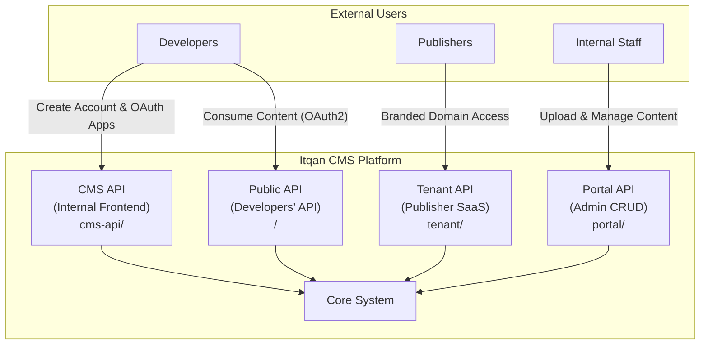
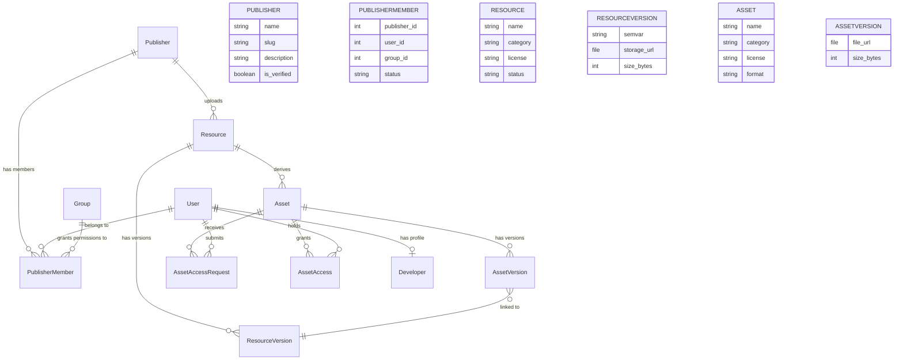
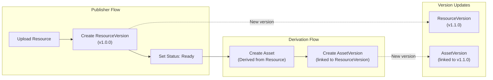
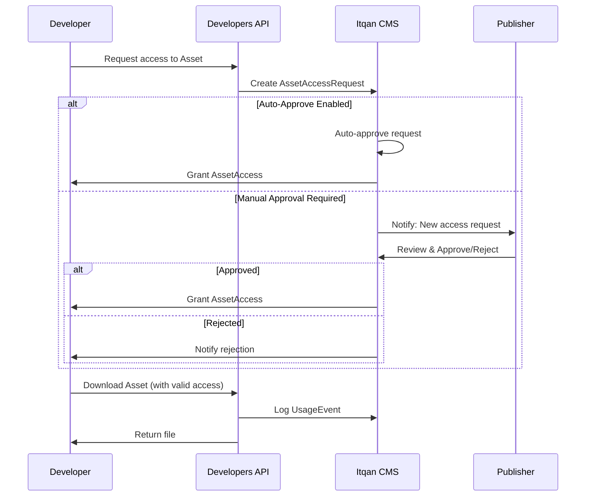
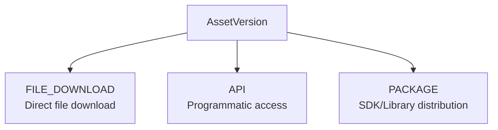
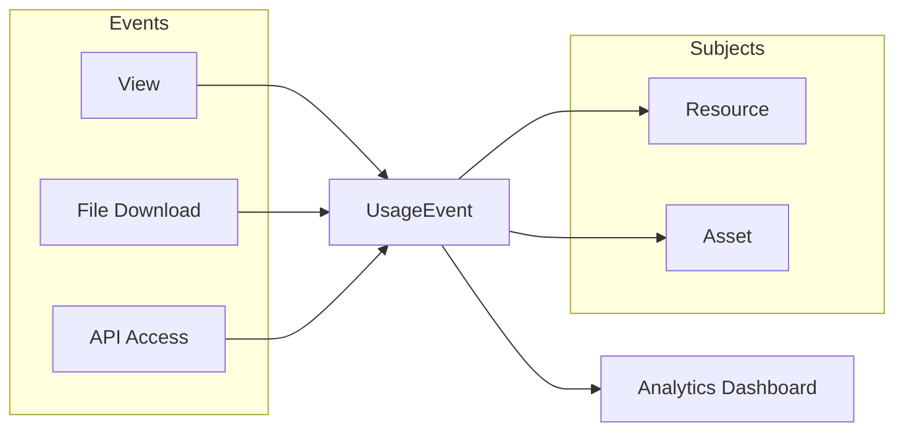
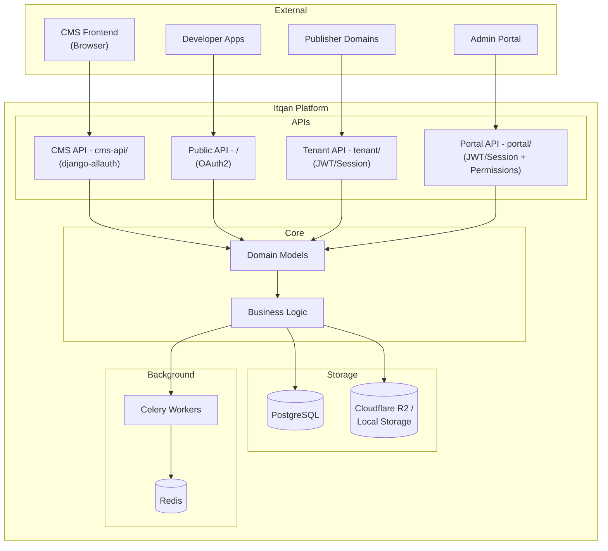
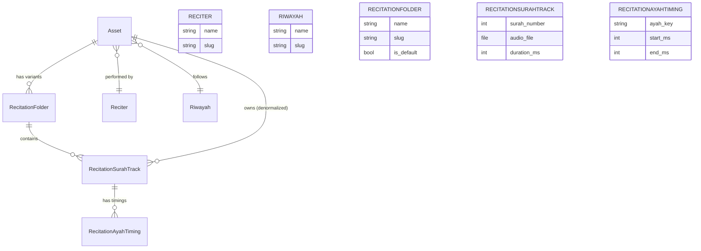

# Itqan CMS — System Architecture

This document provides an overview of the Itqan CMS system architecture from a product perspective, showing the main components, their responsibilities, how they interact, and where the system boundaries lie.

---

## Overview

Itqan CMS is a **Quranic Content Management System** designed to help **Publishers** distribute high-quality, licensed content while enabling **Developers** to integrate it into their applications.

---

## User Types

The system serves **four distinct API surfaces**, each with their own audience and authentication mechanism:

| API | Mount | Purpose | Authentication |
|-----|-------|---------|----------------|
| **CMS API** (Internal) | `cms-api/` | Powers the frontend SPA. Users can create accounts, explore the platform, and create OAuth applications. | django-allauth (JWT), social login (Google/GitHub) |
| **Public API** (Developers') | `/` (root) | Public-facing API consumed by external developers using OAuth applications created via the CMS API. **Expected to receive the majority of traffic.** | django-oauth-toolkit (OAuth2 client credentials) |
| **Tenant API** | `tenant/` | Multi-tenant SaaS API for publishers. Each publisher can have their own domain; content is filtered by the `Domain` the request originates from. All tenants share a single database. | JWT/Session |
| **Portal API** | `portal/` | Internal admin portal for uploading, writing, updating, and managing content (full CRUD). All users are internal company staff. | JWT/Session + group-based permissions |

---

## Core Domain Models

The system is built around a hierarchy of content entities that ensure **authenticity**, **versioning**, and **controlled access**.

---

## Component Responsibilities

### 1. Publisher

The **Publisher** represents an organization or individual who owns and uploads original content.

- Uploads **Resources** (original, unmodified content)
- Manages licensing terms for their content
- Can require approval for each usage request or enable auto-approval
- Has members, each assigned a **permission group** (`PublisherMember.group`, a Django `auth.Group`)
  - Members are invited by `group_id`; the group is chosen from `GET /portal/groups/`, not a fixed role list
  - The group is applied to the user's `auth` groups on invitation acceptance, and drives runtime authorization
  - Membership is per-publisher, so one user may hold a different group at each publisher they belong to
  - The `Itqan Internal` group holds every permission and is never listed or assignable through the portal APIs

### 2. Resource

A **Resource** is the **original, authoritative content** uploaded by a Publisher. It acts as the **source of truth** and remains unmodified.

- Belongs to a single Publisher
- Has a **Category**: `recitation`, `mushaf`, or `tafsir`
- Has a **License** (Creative Commons variants)
- Has a **Status**: `draft` or `ready`

### 3. ResourceVersion

Each **ResourceVersion** represents a specific uploaded file of a Resource, enabling **version tracking**.

- Uses **semantic versioning** (e.g., `1.0.0`, `1.1.0`)
- Contains the actual file (`storage_url`)
- Tracks file size

### 4. Asset

An **Asset** is a **derivation** of a Resource. It represents content that has been adapted or transformed for specific use cases.

> **Example**: A publisher uploads a Tafsir as a PDF (Resource). A contributor then creates a JSON version of the same Tafsir for API consumption — this becomes an Asset derived from the original Resource.

- Linked to a parent Resource
- Inherits or specifies its own license
- Can have multiple preview images
- For recitation assets: linked to a **Reciter** and **Riwayah**, and owns one or more
  **RecitationFolder** variants (see [Recitation-Specific Components](#recitation-specific-components))

### 5. AssetVersion

Similar to ResourceVersion, **AssetVersion** tracks each uploaded file version of an Asset.

- Linked to both an Asset and a ResourceVersion
- Contains the actual downloadable file
- Enables tracking of which Asset version corresponds to which Resource version

---

## Content Lifecycle

---

## Access Control Flow

Publishers control how developers access their content through a **request-approval** workflow.

### Access Request States

| Status | Description |
|--------|-------------|
| `pending` | Request submitted, awaiting review |
| `approved` | Access granted |
| `rejected` | Access denied by publisher |

---

## Developer API Access

Developers can create **OAuth2 applications** via the CMS frontend to access the public API programmatically.

**Key Points:**
- Register account via CMS frontend
- Create OAuth application at `/o/applications/`
- Receive `client_id` and `client_secret`
- Use client credentials flow to obtain access tokens
- Make authenticated API requests

**For complete OAuth flow diagrams, security best practices, and step-by-step guides, see [AUTHENTICATION.md](./AUTHENTICATION.md)**

---

## Distribution Channels

Assets can be distributed through multiple channels:

---

## Usage Tracking

The system tracks all interactions for analytics and auditing:

---

## System Boundaries

---

## Recitation-Specific Components

For recitation-type assets, the system provides specialized tracking:

### Folders (recitation variants)

A **RecitationFolder** sits between `Asset` and `RecitationSurahTrack`. It lets one
recitation be published in several forms — clear sound, with echo and delay, 128kbps,
320kbps, video — without splitting it into separate Assets, so the recitation keeps a
single page.

- Each folder holds its own set of up to 114 surah tracks.
- Uniqueness is `(folder, surah_number)`, **not** `(asset, surah_number)`: the same
  surah exists once per variant.
- Ayah timings hang off the track, so they are per-folder automatically — which matters
  because echo/delay variants have genuinely different offsets.
- Every recitation Asset gets exactly one folder flagged `is_default`, created by a
  `post_save` signal on `Asset` so the invariant also holds for assets made through
  Django admin, fixtures, or data imports.
- `Asset` is kept as a denormalized FK on the track alongside `folder`, because
  publisher scoping (`asset__publisher`) and most queries filter by asset. A model-level
  check rejects any track whose `folder.asset_id` disagrees with its `asset_id`.

**API surface.** No new top-level resources were added.

- Every recitation **track** endpoint accepts an optional `?folder=` filter, resolved by
  `find_folder_by_token`: the value may be a folder's slug **or** its name (matched
  case-insensitively across `name`, `name_ar`, `name_en`). Slug wins when both could
  match, since it is unique per asset. Names are not unique — two folders called "Clear"
  get slugs `clear` and `clear-1` — so an ambiguous name resolves to the default folder
  if present, otherwise the oldest. Omitting the parameter serves the default folder, so
  callers written before folders existed are unaffected. An unresolvable value returns
  `404 folder_not_found` rather than an empty list, so a typo is distinguishable from a
  variant that has no tracks yet.
- The public track endpoint's cache key embeds the **requested** `?folder=` value, not the
  resolved folder, so a warm cache still serves without a DB read. Because that value is
  user input, `folder_cache_token` sanitizes it first — slug-shaped values pass through for
  readability, anything else (spaces, Arabic, overlong input) is hashed, and case is folded
  so equivalent names share one entry.
- Every recitation **list** endpoint (public, tenant, internal) returns a `folders` array
  per row — name, slug, `is_default`, default first — so a consumer can discover the valid
  `?folder=` values. Only the portal API has a recitation *detail* endpoint; it carries the
  same array. The list queryset prefetches `recitation_folders`, so this costs one extra
  query per page rather than one per row.
- Folder CRUD is nested under the existing portal recitations resource at
  `/portal/recitations/{slug}/folders/`. The default folder cannot be deleted
  (`400 cannot_delete_default_folder`), since every other endpoint falls back to it.
- Renaming a folder deliberately does **not** change its slug: the slug is the public
  `?folder=` value, and moving it would break existing links and cached responses.

**Storage.** New uploads are keyed
`uploads/assets/{asset_id}/recitations/{folder_id}/{surah:03}.mp3`. Tracks uploaded
before folders existed keep their original flat keys — nothing in R2 was moved, and each
row stores its own full key, so both layouts coexist permanently.

**Ayah-timing exports.** `sync_asset_recitations_json_file` writes one `AssetVersion`
per folder, named after the folder slug, so variants do not overwrite each other's JSON.

> **Note:** `RecitationAyahTiming` already has the offsets needed to serve individual
> ayah audio, but recitations are currently only distributed as full-surah files.
> Preprocessing surah tracks into servable per-ayah clips is planned — see
> [ROADMAP.md — §2](./ROADMAP.md#2-ayah-by-ayah-recitation-delivery).

---

## Summary

| Component | Responsibility |
|-----------|---------------|
| **Publisher** | Content ownership and governance |
| **Resource** | Original, authoritative content |
| **ResourceVersion** | Version tracking for resources |
| **Asset** | Derived/transformed content for distribution |
| **AssetVersion** | Version tracking for assets |
| **AssetAccessRequest** | Developer access request workflow |
| **AssetAccess** | Granted access records |
| **Distribution** | Defines how assets are delivered |
| **UsageEvent** | Tracks all content interactions |

---

**See also:**
- [Authentication Guide](./AUTHENTICATION.md) — Complete OAuth flows and security practices
- [Roadmap](./ROADMAP.md) — Planned features: app/user self-identification auth,
  ayah-by-ayah recitation delivery, developer-ready data views, Itqan Dependabot &
  asset package manager
- [README.md](./README.md) — Quick start and project overview
